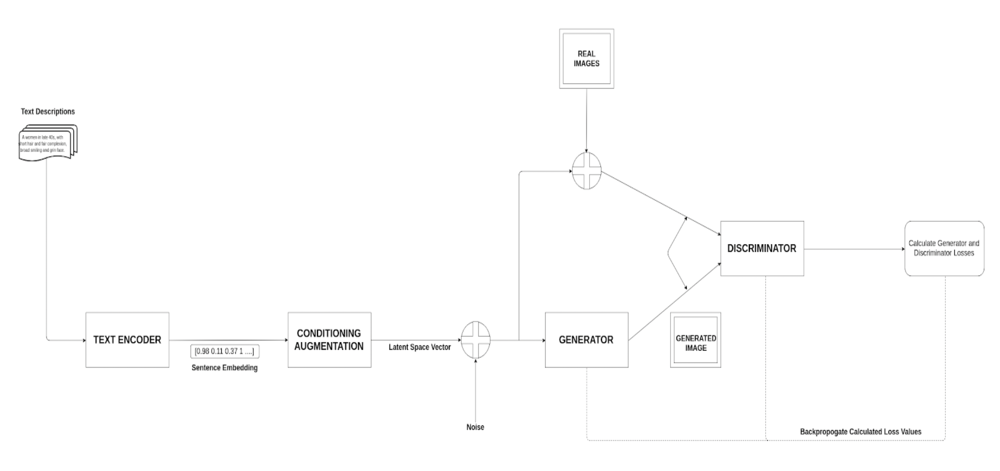

# ArtistGAN

ArtistGAN is a tool used to generate human face images from their descriptions given in textual format.

## FlowChart

## Data Set

### Images:
1. Labelled Faces in the Wild (LFW)
2. CelebA

### Descriptions:
Face2Text for image descriptions

## Architecture

1. Text Encoder

2. Conditioning Augmentation

3. Generative Adversarial Networks (GANs)

4. Feature Tuning

## ArtistGAN Outputs

## Experimental Setup

- **Programming Language:** Python(PyTorch)

- **Libraries:** Numpy, Pillow, Torch, TorchVision, etc.

- **System Configuration:**
  - Processor: Intel Xeon @ 2.30 GHz
  - RAM: 16gb
  - GPU: Google Colab and Kaggle - Tesla T4 and K80

For more details, refer to [this](./ArtistGAN.pptx) presentation and [thesis report](https://docs.google.com/document/d/1uakd5dLHmJHw2fVydgTmoUyyETn7jdPCGYfOeVKdqq8/edit?usp=sharing).